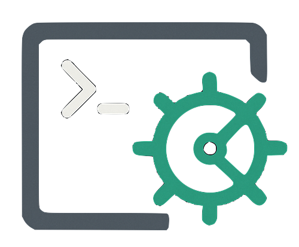

# Shell Keeper (sk)

Shell Keeper is a command-line tool to save, retrieve, and manage your favorite shell commands. It features interactive navigation, clipboard integration, and customizable storage location.

## Features

- Save shell commands with a name and description
- Retrieve commands interactively (arrow keys, Enter to copy)
- Remove commands interactively
- Store commands in a JSON file (customizable location)
- Installable as a global executable (`sk`)


## Installation

### Recommended: Install with pipx

1. Clone the repository:

   ```sh
   git clone https://github.com/trevortomesh/shell-keeper.git
   cd shell-keeper
   ```

2. Install pipx (if not already installed):

   ```sh
   brew install pipx
   ```

3. Install Shell Keeper globally:

   ```sh
   pipx install .
   ```

4. Ensure pipx's binary directory is on your PATH:

   ```sh
   pipx ensurepath
   source ~/.zshrc  # or restart your terminal
   ```

After this, you can run `sk` from anywhere in your shell.

### Alternative: Install with pip (not recommended for Homebrew Python)

```sh
pip install . --break-system-packages
```

Or use a virtual environment:

```sh
python3 -m venv ~/sk-venv
source ~/sk-venv/bin/activate
pip install .
```

This will make the `sk` command available only within the virtual environment.

## Usage

### Save a command

```sh
sk save <name> '<shell command>' -d 'description'
```

Or pipe a command:

```sh
echo "ls -la" | sk save mylist -
```

### List commands

```sh
sk list
```

### Retrieve a command interactively

```sh
sk
```

Use arrow keys to navigate, Enter to copy to clipboard.

### Remove a command interactively

```sh
sk -rm
```

Use arrow keys to select, Enter to delete.

### Custom JSON file location

Set with environment variable or CLI flag:

```sh
export SK_COMMANDS_FILE=~/my_commands.json
sk save ...
```

Or:

```sh
sk save ... -f ~/my_commands.json
```

## Requirements

- Python 3
- `pyperclip` (installed automatically)

## License

MIT
